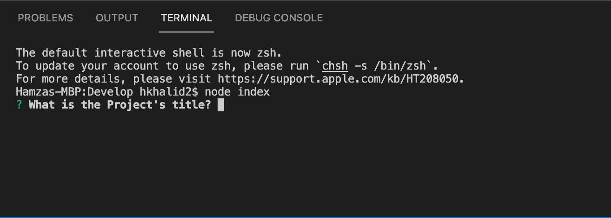
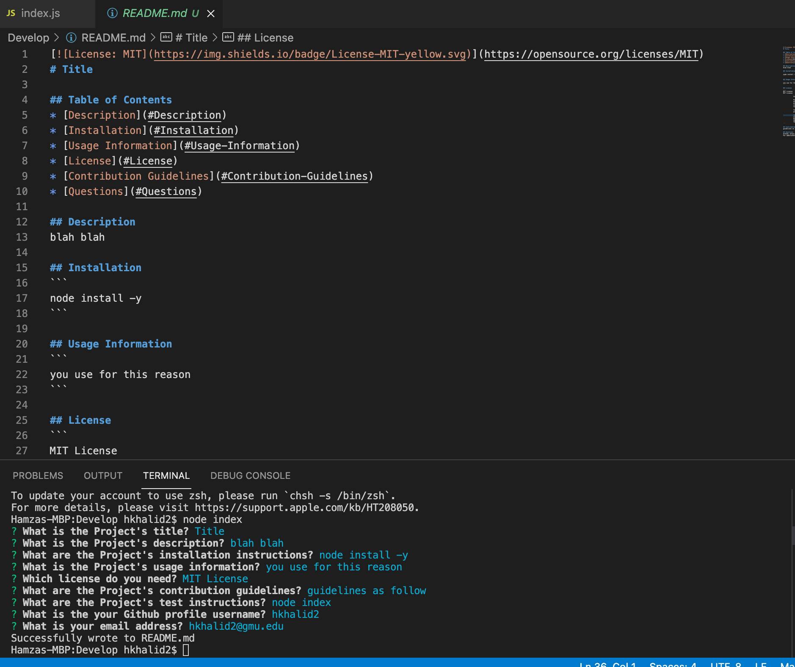

# READMEGenerator

## Description
The main motivation for creating this project was to make the README writing process easier for developers. This app takes user input using the terminal and generates a formatted README using said input. 

The main problems this app solves include:
* Formatting a linked table of contents 
* Adding badges/notices depending on the license 
* Linking ones Github/email 
* Adding description, installation instructions, usage information, contribution guidelines and test instructions

Overall this project taught me specifically how to install packages using node.js, use inquirer in order to obtain user inputted information and also how to format various characteristics using MD. 

## Installation
Node was required to be installed as well as inquirer.
``node install -y
  node install inquirer``

## Usage
``node index.js``

## License 
MIT License

            Copyright (c) 2021 Hamza Khalid
            
            Permission is hereby granted, free of charge, to any person obtaining a copy of this software and associated documentation files (the "Software"), to deal in the Software without restriction, including without limitation the rights to use, copy, modify, merge, publish, distribute, sublicense, and/or sell copies of the Software, and to permit persons to whom the Software is furnished to do so, subject to the following conditions:
            
            The above copyright notice and this permission notice shall be included in all copies or substantial portions of the Software.
            
            THE SOFTWARE IS PROVIDED "AS IS", WITHOUT WARRANTY OF ANY KIND, EXPRESS OR IMPLIED, INCLUDING BUT NOT LIMITED TO THE WARRANTIES OF MERCHANTABILITY, FITNESS FOR A PARTICULAR PURPOSE AND NONINFRINGEMENT. IN NO EVENT SHALL THE AUTHORS OR COPYRIGHT HOLDERS BE LIABLE FOR ANY CLAIM, DAMAGES OR OTHER LIABILITY, WHETHER IN AN ACTION OF CONTRACT, TORT OR OTHERWISE, ARISING FROM, OUT OF OR IN CONNECTION WITH THE SOFTWARE OR THE USE OR OTHER DEALINGS IN THE SOFTWARE
            
## Badges

## Screenshots
### Demo Video

### Terminal invocation

### Outputted README

